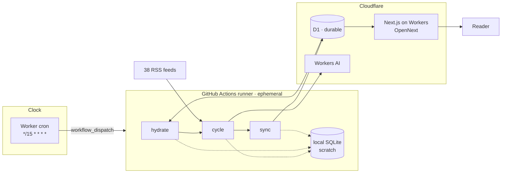
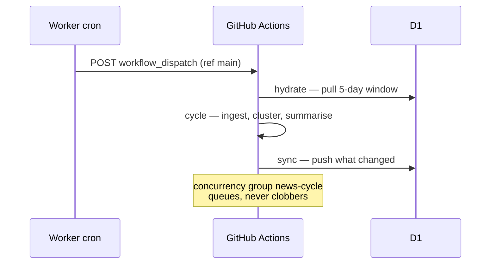
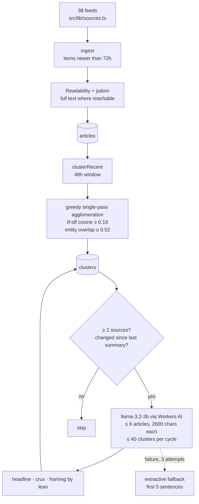
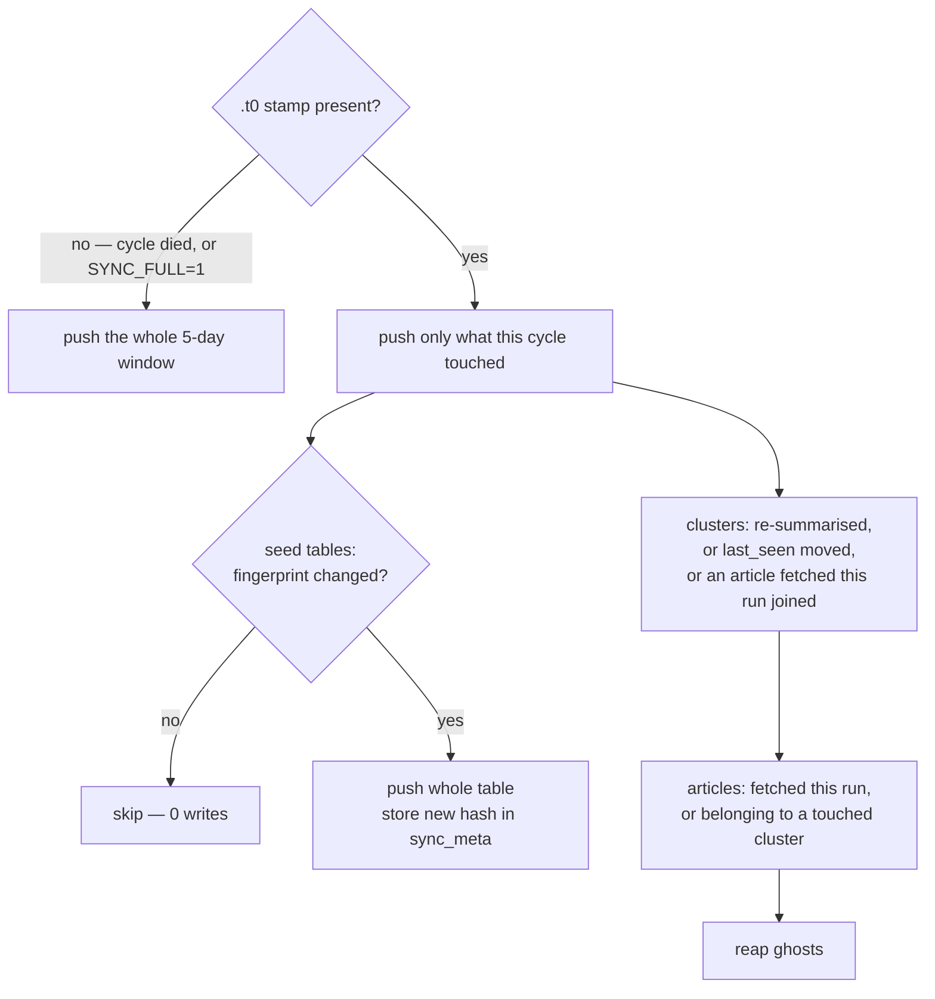
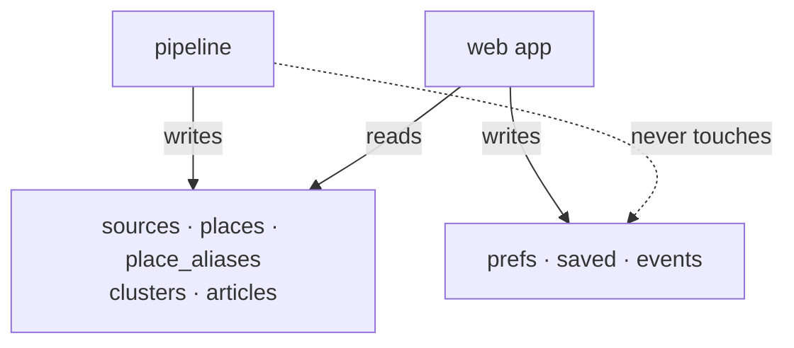

# Architecture

Smart News has two runtimes and one durable store. A GitHub Actions job is the
only writer of news; a Cloudflare Worker serves the site and is the only writer
of reader state. Cloudflare D1 sits between them.

## Why the pipeline is not in the Worker

Clustering issues thousands of statements per run. Over HTTP each one is a
round trip, and free-tier Workers give ~10ms CPU per invocation. So the
pipeline runs against local `node:sqlite` on a runner that has real CPU and a
real file, and D1 holds the result. The runner keeps nothing between runs —
hence hydrate at the start and push at the end.

## Why the clock is a Worker

GitHub queues a `*/15` schedule and drops most firings when its shared pool is
busy: runs were landing every two to four hours at unaligned times. The Worker
holds the clock and calls `workflow_dispatch`, which GitHub honours. The
workflow has no `schedule` trigger at all.

## One cycle

Clustering is order-dependent and re-runs from scratch each cycle over the
48-hour window: an article joins the nearest centroid above threshold, or
starts its own cluster. Two clusters that merge leave the loser's id behind in
D1 — see reaping below.

## Windows

Three different horizons, widest first, and they must stay ordered.

| Stage | Window | Why |
|---|---|---|
| hydrate / sync | 5 days | must be wider than clustering, or a cluster loses its own articles |
| ingest | 72 hours | feed items older than this are dropped on arrival |
| cluster | 48 hours | what a run actually re-groups |

## Sync mechanism

The expensive direction is the push, because D1 bills row writes and
`INSERT OR REPLACE` bills whether or not the value moved. Three mechanisms
keep it small.

**1 · The `.t0` stamp.** `cycle` writes its start time next to the database on
the way out, and writes it *last*: a cycle that dies leaves no stamp, and the
next sync safely falls back to the full window. With a stamp, sync pushes only
rows the cycle touched — roughly 2,800 rows becomes a few dozen.

**2 · Seed fingerprints.** `sources`, `places` and `place_aliases` change only
when someone edits the seed, but they were going up whole every cycle: 1,372
rows × 96 cycles = 131k writes a day, past D1's 100k free daily limit on its
own. Each is now hashed and pushed only on a change, with the hash kept in
`sync_meta` in D1 because the runner remembers nothing between cycles.

**3 · Reaping.** When two clusters merge, the loser vanishes locally but
survives in D1 as a ghost story — a second card for an event that already has
one, opening on an empty article list. `reap` deletes remote cluster ids absent
locally, nulling `articles.cluster_id` first because D1 does not enforce the
foreign key. It refuses when more than a tenth of the window looks absent: a
store that was never hydrated is indistinguishable from "everything merged".

## Who writes what

`prefs` is deliberately not synced: the app is its only writer, and carrying
the hydrated copy back up would revert whatever the reader changed while the
cycle was running.

## Failure modes

- **LLM unavailable or malformed** — three attempts, then an extractive
  fallback (first five sentences, headline trimmed of the outlet suffix), so a
  cluster always has something to show.
- **D1 daily row-write limit** — the run fails on push and heals at midnight
  UTC. Watch this whenever cycle frequency or row volume rises.
- **Overlapping runs** — impossible by construction: the workflow's
  `concurrency: news-cycle` group queues rather than cancels, because two runs
  sharing one D1 would clobber each other's cluster assignments.
- **PAT expiry** — the Worker's `GITHUB_TOKEN` is a fine-grained PAT with
  Actions: write. If it lapses, dispatch 401s silently and the site simply
  stops updating.
