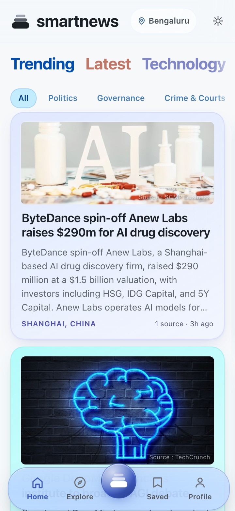
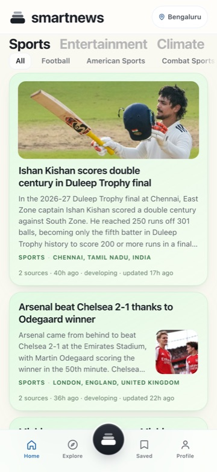
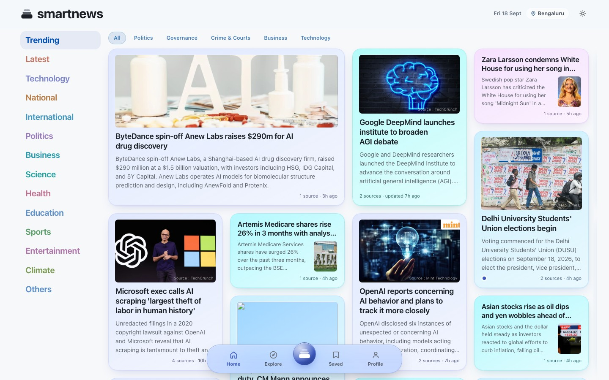
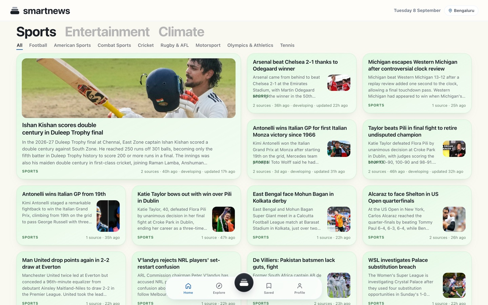
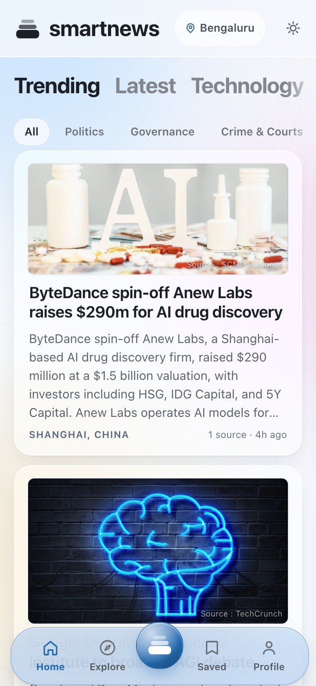
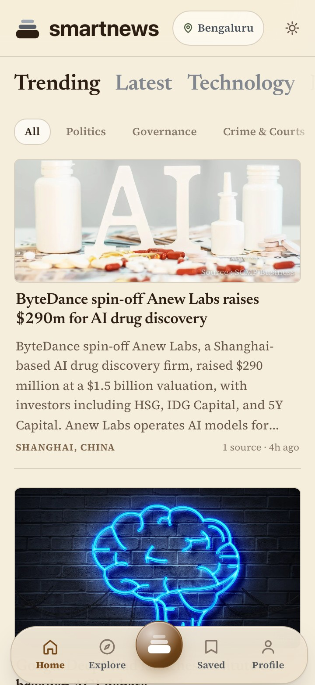

# Smart-News

A world-news reader that clusters the same story across many outlets and has a model write one neutral summary of it. For anyone who would rather read one corroborated account than six versions of the same wire copy.

The npm package and the deployed Worker are both named `smartnews`; the repo is `Smart-News`.

[Live site](https://smartnews.nvkudva.workers.dev) - [Model and provider notes](docs/MODELS.md)

## What it looks like

Shown in the Pastel theme, where each card takes a quiet tint from its category.
Three others ship with it — Frosted, Broadsheet and Ambient — and the picker is
under Profile.

| Mobile — the feed | Mobile — a category |
|---|---|
|  |  |

A phone is where news is read, so it is the size the design is drawn at and the
one these shots lead with. The bar sits at the bottom at every width — thumb
first, and unchanged on a desktop rather than relegated to a corner — and the
category strip is one horizontal row that holds the selected category against
the left edge.

The same two screens with room to spread out:

| Desktop — the feed | Desktop — a category |
|---|---|
|  |  |

### The other three

| Frosted — the default | Broadsheet | Ambient |
|---|---|---|
|  |  |  |
| White glass over a soft wash. | Paper, serif headlines, hairlines instead of cards. | Dark and warm, on an ember palette. |

Frosted is the shipped design; Broadsheet and Ambient were drawn beside it on
the same canvas and carry its geometry with their own colour and type. The
choice is kept per device, not in the account.

## Requirements

- Node 22 or newer. The pipeline uses the built-in `node:sqlite` module; CI runs Node 26.
- A Cloudflare account with a D1 database. The web app never reads local SQLite — it reads D1, through the Workers binding on Workers and the D1 REST API everywhere else. `npm run dev` therefore needs `CLOUDFLARE_ACCOUNT_ID`, `CLOUDFLARE_API_TOKEN` and `CLOUDFLARE_D1_ID`.
- One LLM key, for summaries: a Cloudflare API token (Workers AI), or a Gemini, DeepSeek or OpenAI key. Any OpenAI-compatible server — LM Studio, Ollama, vLLM, OpenRouter — works via `LLM_BASE_URL` and needs no hosted key.
- Ingest and clustering run without any key. Without one, summarisation falls back to quoting the longest single source verbatim.

## Run it

```bash
git clone https://github.com/nvkudva/Smart-News.git
cd Smart-News
npm install
cp .env.local.example .env.local    # fill in the variables below
npm run ingest                      # pull the RSS feeds, extract full text
npm run pipeline 60                 # cluster, then summarise the top 60 clusters
npm run dev                         # http://localhost:3000
```

`npm run ingest` prints a per-feed article count; `npm run dev` should serve a ranked feed of clustered stories at `http://localhost:3000`. `ingest` is safe to re-run — it skips URLs already stored — and `pipeline` only summarises clusters that are new or have grown 40%.

## Configuration

| Variable | Required | What it is |
|---|---|---|
| `LLM_PROVIDER` | No | `cloudflare` (the default when unset), `gemini`, `deepseek` or `openai`. The shipped `.env.local.example` sets `gemini`, so edit or delete that line to get the code default. |
| `LLM_API_KEY` | One key | Overrides the per-provider key below. |
| `CLOUDFLARE_API_TOKEN` | For `cloudflare` | Workers AI key, and the D1 REST credential. |
| `CLOUDFLARE_ACCOUNT_ID` | For `cloudflare` | Required by the Workers AI base URL and by the D1 REST client. |
| `CLOUDFLARE_D1_ID` | For `npm run dev` | D1 database id the site and the sync scripts read. |
| `GEMINI_API_KEY` / `DEEPSEEK_API_KEY` / `OPENAI_API_KEY` | Per provider | Key for the chosen hosted provider. |
| `LLM_BASE_URL` | No | With `LLM_PROVIDER=openai`, any OpenAI-compatible endpoint. |
| `LLM_MODEL` | No | Model id. Each provider has a working default. |
| `LLM_RPM`, `LLM_CONCURRENCY` | No | Request pacing. Free tiers are strict. |
| `LLM_JSON_MODE` | No | `schema`, `object` or `text` — servers disagree on structured output. |
| `SUMMARISE_MIN_SOURCES` | No | Default 2. The cost dial: how many independent outlets a cluster needs before it is summarised. |
| `SMARTNEWS_DB` | No | Local SQLite path. Defaults to `data/smartnews.db`. |

## How it works

Every fifteen minutes: read the feeds, cluster what is the same story, summarise each cluster once, push the results to D1. The browser then reads those results without waking a server for most of it. Each stage is below, in order.

The pipeline and the site deliberately use different stores. The pipeline writes local SQLite because a cluster run issues thousands of statements, each of which would otherwise be an HTTP round trip; the site reads D1 through `src/lib/d1.ts`. `scripts/hydrate-d1.ts` pulls the working window down and `scripts/sync-d1.ts` pushes results back, which is what lets `.github/workflows/cycle.yml` run `hydrate` → `cycle` → `sync` on a runner with no persistent disk.

`npm run deploy` migrates D1 before it builds. This is not optional ceremony:
the schema lives in two files (`src/lib/db.ts` for local SQLite, `scripts/d1-schema.ts`
for D1), every statement in them is `CREATE TABLE IF NOT EXISTS`, and a column
added later therefore arrives only through the guarded `ALTER`s in
`ADDED_COLUMNS`. Those used to run at the tail of `npm run sync` — which is the
wrong moment, because a release that reads a new column is live the instant it
deploys, and until the next cycle every request in the gap throws *no such
column*. Adding a column means adding it to both files and to `ADDED_COLUMNS`;
`npm run migrate:d1 -- --check` reports what a live database is missing, and
exits non-zero if the two files have drifted apart.

`deploy/install-schedule.sh` installs the same 15-minute cycle as a launchd agent. It is macOS only — on Linux, or anywhere else, use the GitHub Actions workflow instead. Do not run both against one D1: two concurrent cycles clobber each other's cluster assignments.

### End to end, step by step

**Gathering**

- `src/lib/sources.ts` is the list — 55 feeds, hand-curated, each with a country, a category and a political lean rated against its own country's politics. A feed enters the file only after three checks: it parses, its articles yield readable text through Readability, and its `robots.txt` permits the fetch.
- `scripts/ingest.ts` reads every feed, normalises each link (dropping tracking parameters, which is not cosmetic — Al Jazeera's `robots.txt` disallows the `?traffic_source=` variant its own feed emits), and skips URLs already stored.
- Before fetching an article, `src/lib/robots.ts` checks that host's `robots.txt` under RFC 9309 — most specific agent group, longest matching path, `Allow` breaking ties — caching one fetch per host per run and honouring `Crawl-delay` per host.
- Full text is extracted with jsdom and Readability. Summaries come from the article, never the RSS blurb. A body that fails is retried on later runs for an hour, so a transient error is not permanent.

**Clustering**

- `src/lib/cluster.ts` builds a TF-IDF vector per article from the title (weighted 3x) and lead, then does single-link agglomeration inside a 48-hour window, requiring a shared named entity so two unrelated stories cannot merge on vocabulary alone.
- `source_count` counts *newsrooms*, not URLs. A wire story carried by five outlets is one piece of reporting, so near-identical bodies collapse — compared by Jaccard over five-word shingles, not the clustering's cosine, because IDF over a handful of documents discounts precisely the shared text that identifies a copy.

**Summarising**

- One LLM call per cluster, never per article. Up to six articles, one per outlet, 1,800 characters each, all in a single prompt so the model synthesises across outlets rather than paraphrasing one.
- The model returns a headline, a crux, a category, a place, an importance score, and one sentence per political lean describing how those outlets framed it.
- `SUMMARISE_MIN_SOURCES` (default 2) is the cost dial: a story only one outlet ran is what a corroboration-ranked feed should be sceptical of, and also the cheapest thing not to summarise. Clusters are re-summarised only after growing 40%.

**Storing**

- `scripts/sync-d1.ts` pushes finished rows to D1 in batches, fingerprinting the tables that rarely change so unchanged rows are not rewritten, and paging by key rather than `OFFSET` — `OFFSET n` makes SQLite walk and discard n rows, which alone was costing millions of reads a day.

**Serving**

- Page shells are prerendered into Workers Static Assets, which are free and uncounted against the Workers request limit, so a category page costs no D1 read and no render.
- The gazetteer — 338 places and their aliases — is compiled into the bundle rather than queried, because it only changes when someone edits the seed and redeploys.
- `src/lib/feed.ts` ranks per request on recency (9-hour half-life), corroboration, importance and stated interest, weighted for a readership of engineers who also follow markets, with a lift for stories whose text reads as macro-economic whatever category they were filed under. Every fourth slot is reserved for something outside the reader's stated interests.

**Reading and refreshing**

- `public/sw.js` is a hand-written service worker: hashed build output cached forever, `/api/*` stale-while-revalidate on a 60-second threshold, images for a day, and documents network-first with the cache as an offline fallback.
- The client asks `/api/section/[cat]` for rows as you move between categories, so switching sections is a JSON fetch rather than a server render.
- New articles arrive because the 15-minute cycle writes them; the service worker shows what it has instantly and replaces it behind you, and `UpdateBanner` watches `/BUILD_ID` to prompt a reload when the site itself has been redeployed.

## Status

Ingest, clustering, summarisation, the D1 sync, the ranked feed, story pages and saved stories all work, and the scheduled Actions cycle runs against the live site.

Known gaps, from the code review in `REVIEW.md` (7 September 2026):

- **The deployed site has no authentication.** Every write is keyed `user_id = 'local'`, so any visitor overwrites the one shared preferences row and the one shared saved list.
- **Scraped article bodies are interpolated into the prompt unescaped.** A hostile page can steer the headline and summary the front page shows.
- `scripts/sync-d1.ts` `reap()` deletes D1 clusters missing from a freshly hydrated local file, guarded only by a 10% heuristic. A short hydrate can delete real rows irrecoverably.
- Nothing prunes D1 outside the 5-day window, so storage grows without limit.
- There are no tests and no lint config. `npm run build:check` is the only typecheck and no workflow runs it.
- Reels, theme variants, GPS-local news, the left/centre/right coverage breakdown and the credibility signal are not built. `sources.bias` is declared in the schema and read by nothing.

Provider cost and quality figures are in [docs/MODELS.md](docs/MODELS.md); treat any number there as a single measurement on one machine, not a guarantee.

## License

No licence file yet — all rights reserved.
